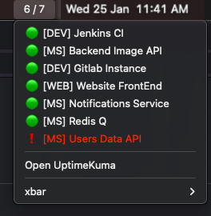

xBar-Uptime-Kuma
[](https://github.com/mariogarridopt/xBar-Uptime-Kuma/issues)
[](xbar://raw.githubusercontent.com/mariogarridopt/xBar-Uptime-Kuma/master/uptimekuma.30s.py)]
===

This is a [xBar Plugin](https://github.com/matryer/xbar) & [Uptime Kuma addon](https://github.com/louislam/uptime-kuma) that allows you to display your monitored status on the Macbook taskbar.



## How to use it

1. Copy the `uptimekuma.30s.py` file into your xBar scripts folder;
2. Make sure the file has execution permissions `chmod +x uptimekuma.30s.py`;
3. Install python dependencies `pip install uptime-kuma-api`
4. Open `.py` file and change the following fields:
```python
# -------------------------------------------
BASE_URL = 'http://localhost:3001' # uptime kuma URL no trailing slash
USERNAME = 'admin' # uptime kuma username
PASSWORD = 'admin' # uptime kuma password
# -------------------------------------------
```
5. You are ready!

## Dependencies

Since [Uptime Kuma](https://github.com/louislam/uptime-kuma) does not have a formal API([#8](https://github.com/mariogarridopt/xBar-Uptime-Kuma/issues/8)), I had to use [uptime-kuma-api](https://github.com/lucasheld/uptime-kuma-api).
This is not great because for this to work now you have to install dependencies first:
```bash
pip install uptime-kuma-API
```
We might remove this dependence when Uptime Kuma publishes an official API.

## Contributing

This project is only possible because of your help.
If you find any bug please report it at [issues](https://github.com/mariogarridopt/xBar-Uptime-Kuma/issues).

[How to make a contribution](CONTRIBUTING.md)

### License

This project is available under the GPL-3.0 license.
